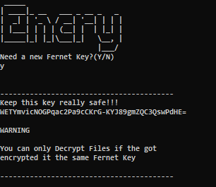
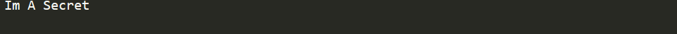
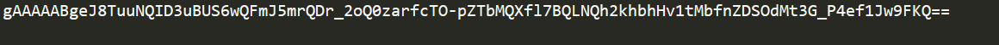

```
  _____ _ _            _____                             _
 |  ___(_) | ___      | ____|_ __   ___ _ __ _   _ _ __ | |_ ___ _ __
 | |_  | | |/ _ \_____|  _| | '_ \ / __| '__| | | | '_ \| __/ _ \ '__|
 |  _| | | |  __/_____| |___| | | | (__| |  | |_| | |_) | ||  __/ |
 |_|   |_|_|\___|     |_____|_| |_|\___|_|   \__, | .__/ \__\___|_|
                                             |___/|_|
```

# File Encrypter/Decrypter :octocat:

Basically this a script to Decrypt/Encrypt the files that you whant to keep safe, **i left a example on the Files Folder that will be a example for you to solve.**
**If you solve it you can get a BTC Wallet** **it *0.5429BTC* .**

The Fernet key used to Encrypt the file is in the **FigletUsed.txt** File!

## Warning

**If you encrypted a important file, make sure you DONT forget or lose the fernet key, you will need the same Fernet key to decrypt the file**

*The Script let's you create a Fernet key before starting to use it!*

## Example:

### First We generate a Fernet Key.



### We Select a File To Encrypt.



### We Select Option 1 and Encrypt the File!


